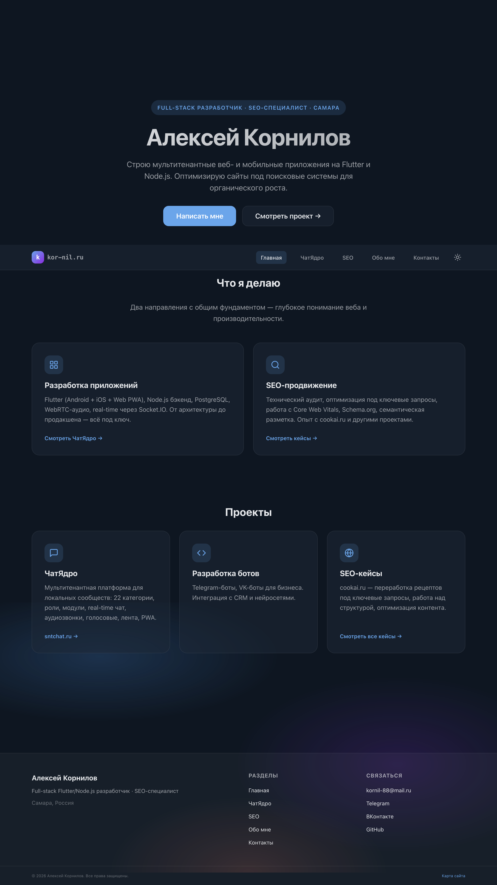
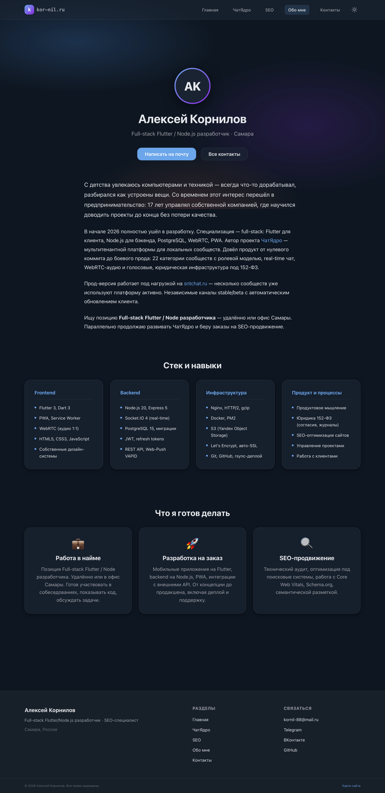
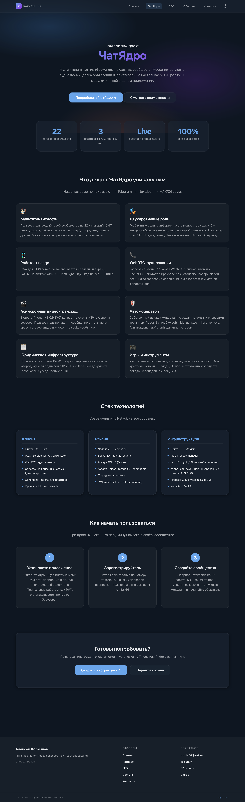

# kor-nil.ru

Personal portfolio site of Aleksey Kornilov — Full-stack Flutter & Node.js developer.



**Live:** [kor-nil.ru](https://kor-nil.ru)

---

## About

Static portfolio + business card site presenting my full-stack development and SEO services.
Built as a hand-crafted static site — no CMS, no React, no framework overhead. Just clean
HTML, modular CSS, and vanilla JavaScript, generated by [Eleventy](https://www.11ty.dev/).

---

## Screens

### About page



### ChatYadro project page



---

## Tech Stack

- **Eleventy 3.x (11ty)** — static site generator
- **Nunjucks** — template language
- **Vanilla JavaScript** — no frameworks
- **CSS** — modular architecture (base + components + pages)
- **HTML5** — semantic markup
- **JSON-LD** — Schema.org structured data

---

## Key decisions

- **Static-first.** Eleventy generates plain HTML at build time — instant page loads,
  perfect Core Web Vitals, trivial hosting (nginx serves it directly from disk).
  No SSR, no hydration, no JS framework tax for a content site.
- **Modular CSS without preprocessors.** Vanilla CSS split by concern:
  `base` (reset + variables), `components` (button, card, glass, nav, footer),
  `pages` (page-specific). Each file under 150 lines, easy to reason about.
- **Glassmorphism as visual identity.** Shared design language with my main product
  ChatYadro ([sntchat.ru](https://sntchat.ru)) — auroral background gradients,
  frosted glass surfaces, soft borders. Light and dark themes with system-preference
  detection.
- **SEO-first architecture.** Semantic HTML5, JSON-LD (`Person`, `WebSite`, `WebPage`,
  `SoftwareApplication`), auto-generated `sitemap.xml`, `robots.txt`, Open Graph +
  Twitter Card meta, `prefers-reduced-motion` handling, unique per-page titles and
  descriptions.

---

## Getting started

```bash
npm install
npm run dev       # local dev server at http://localhost:8080
npm run build     # production build to ./dist
```

---

## Project structure

```
kor-nil/
├── src/
│   ├── _data/
│   │   └── site.json            # global site data (contacts, SEO keywords)
│   ├── _includes/
│   │   ├── layouts/
│   │   │   └── base.njk         # base HTML layout
│   │   └── components/          # header, footer, head
│   ├── assets/
│   │   ├── css/
│   │   │   ├── base.css
│   │   │   ├── layout.css
│   │   │   ├── components/      # button, card, glass, nav, footer, theme
│   │   │   └── pages/           # per-page styles
│   │   └── js/                  # nav, theme-toggle, contact-form
│   ├── projects/
│   │   └── chatyadro.njk
│   ├── about.njk
│   ├── contact.njk
│   ├── index.njk
│   ├── robots.txt
│   └── sitemap.njk
├── eleventy.config.mjs
├── package.json
├── screenshots/                 # README previews
└── README.md
```
